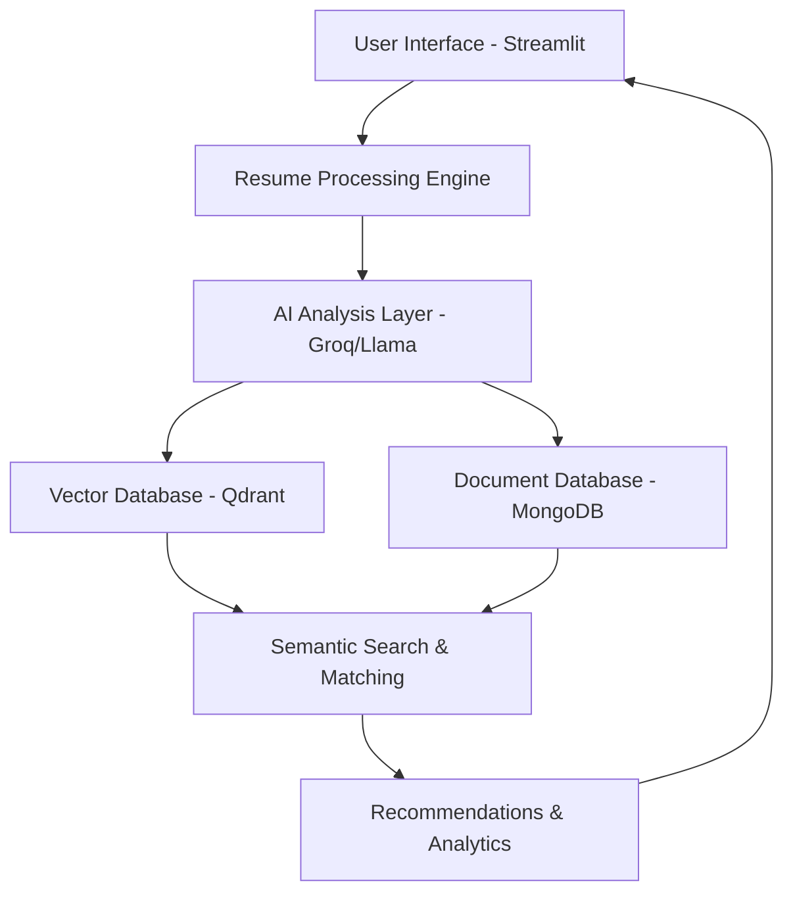
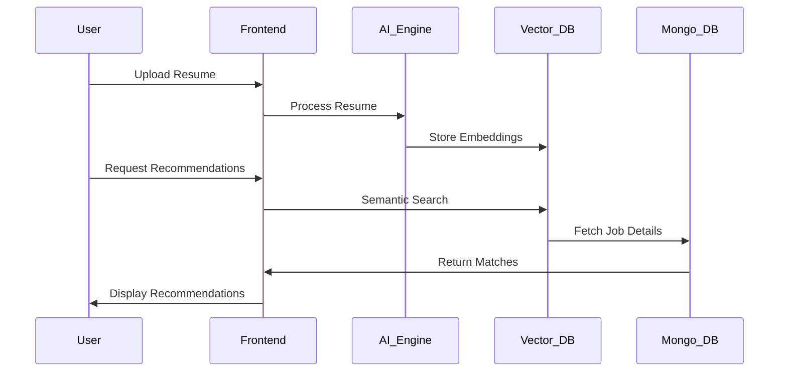

# 🤖 AI-Powered Recruitment Platform

[](https://streamlit.io/)
[](https://www.mongodb.com/)
[](https://python.org)
[](https://huggingface.co/)
[](LICENSE)

> An intelligent recruitment platform that revolutionizes candidate screening using AI-powered semantic matching and Retrieval-Augmented Generation (RAG).

## 🎯 Features

- 🚀 **Smart Resume Matching** - AI-powered job recommendations with similarity scores
- 📄 **Automated Resume Analysis** - Extract skills, experience, and candidate details  
- 🏢 **Job Description Generation** - Create realistic jobs across multiple domains
- 📊 **Analytics Dashboard** - Comprehensive market insights and trends
- 🔍 **Semantic Search** - Advanced vector-based job matching
- 📱 **Responsive Design** - Works on all devices and browsers

## 🛠️ Tech Stack

| **Category** | **Technology** | **Purpose** |
|--------------|----------------|-------------|
| **Frontend** |  | Web interface & UI |
| **Vector DB** |  | Semantic search & embeddings |
| **Database** |  | Document storage |
| **AI/ML** |  | LLM API integration |
| **Embeddings** |  | Text vectorization |
| **LLM** |  | Natural language processing |
| **File Processing** |  | PDF/DOCX/TXT parsing |

## 🏗️ Architecture



## 🚀 Quick Start

### Prerequisites

```bash
# System Requirements
- Python 3.8+
- Modern web browser
- Stable internet connection (min 1 Mbps)
```

### Installation

```bash
# Clone the repository
git clone https://github.com/username/ai-recruitment-platform.git
cd ai-recruitment-platform

# Install dependencies
pip install -r requirements.txt

# Set up environment variables
cp .env.example .env
# Edit .env with your API keys and database connections

# Run the application
streamlit run app.py
```

### Environment Variables

```bash
# .env file
GROQ_API_KEY=your_groq_api_key
MONGODB_URI=your_mongodb_connection_string
QDRANT_URL=your_qdrant_instance_url
QDRANT_API_KEY=your_qdrant_api_key
HUGGINGFACE_TOKEN=your_hf_token
```

## 📖 Usage

### 1. Upload Resume
```python
# Supported formats: PDF, DOCX, TXT (max 10MB)
uploaded_file = st.file_uploader("Choose a resume file")
```

### 2. Job Management
- **Auto-generate jobs** across 6+ domains
- **Manual job entry** for custom descriptions  
- **Search & filter** existing job database

### 3. Get AI Recommendations
- Upload resume → Process with LLM → Generate vector embeddings
- Semantic search against job database
- Receive ranked matches with similarity scores

### 4. Analytics Dashboard
- Job market insights and trends
- Skills demand analysis
- Geographic distribution
- Company and domain metrics

## 📊 System Workflow



## 🚀 Deployment

### Docker
```bash
# Build image
docker build -t ai-recruitment-platform .

# Run container
docker run -p 8501:8501 ai-recruitment-platform
```

### Streamlit Cloud
1. Connect GitHub repository
2. Set environment variables
3. Deploy automatically

## 🤝 Contributing

1. Fork the repository
2. Create feature branch (`git checkout -b feature/AmazingFeature`)
3. Commit changes (`git commit -m 'Add AmazingFeature'`)
4. Push to branch (`git push origin feature/AmazingFeature`)
5. Open a Pull Request

## 🐛 Known Issues

- Large PDF files (>5MB) may take longer to process
- Some DOCX files with complex formatting might not parse correctly
- Rate limiting on Groq API during high usage

## 🔒 Security

- No personal data stored locally
- Encrypted database connections
- API key environment variables
- Session-based resume processing
- GDPR compliant data handling

## 📊 Statistics


## 📜 License

This project is licensed under the MIT License - see the [LICENSE](LICENSE) file for details.

## 👨‍💻 Author

**Valenteno Lenora**
- GitHub: [@username](https://github.com/Nightking-v)
- LinkedIn: [Profile](https://linkedin.com/in/valentenolenora)
- Email: valentenocavlenora@gmail.com

## 🙏 Acknowledgments

- [Streamlit](https://streamlit.io/) for the amazing web framework
- [Groq](https://groq.com/) for lightning-fast LLM inference
- [Qdrant](https://qdrant.tech/) for vector database capabilities
- [Hugging Face](https://huggingface.co/) for embeddings and models
- [MongoDB](https://www.mongodb.com/) for document storage

---

<div align="center">

**⭐ Star this repo if you find it useful! ⭐**

Made with ❤️ by [Valenteno Lenora](https://github.com/Nightking-v)

[](https://streamlit.io/)
[](https://github.com/username/ai-recruitment-platform)

</div>